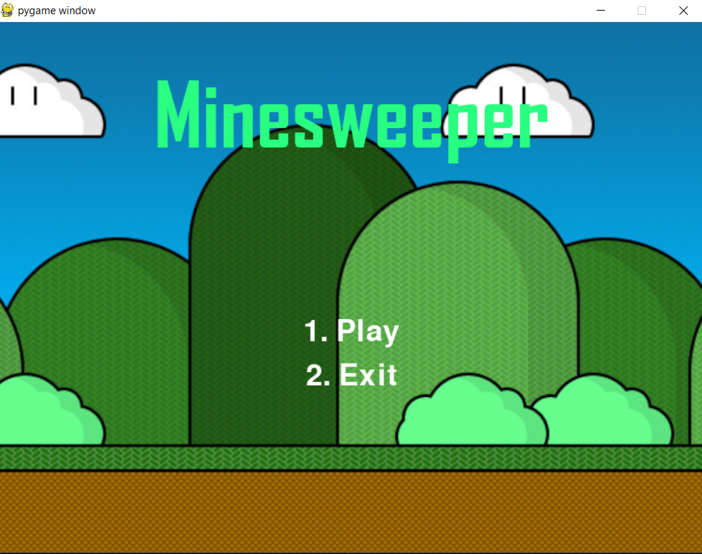
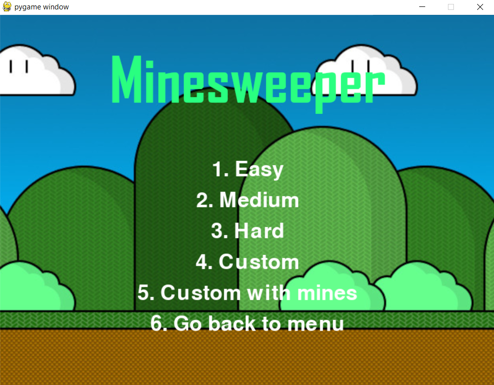
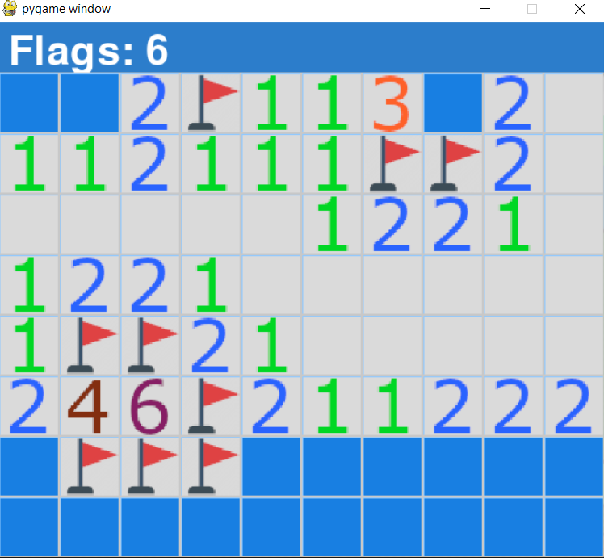

# MINESWEEPER
## Description

A simple minesweeper game made with Python and Pygame. Minesweeper is a game where the player has to reveal all cells that do not contain a mine. If a cell with a mine is revealed, the game is over.

Several difficulty levels are available:

The game:

## How to play

- Left click to reveal a cell
- Right click to flag a cell

## How to run

1. Download the latest release from the releases tab or clone the repository
2. Launch the game by running Minesweeper.exe
3. Enjoy!

